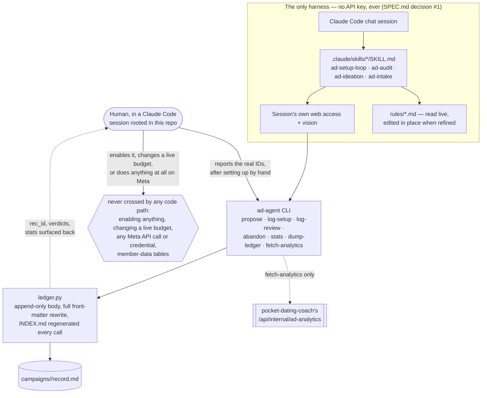
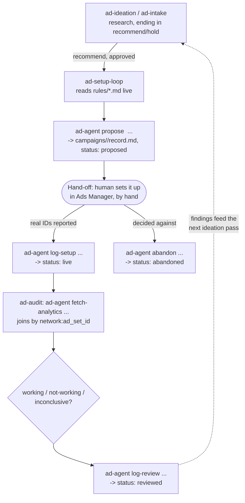

# Agent registry

A reference inventory of every skill in this system: what it's called, what it does, the exact procedure
it follows, and the precise point where it hands control back to a human. This page is the technical
companion to [How the four modes work](How-the-four-modes-work) and
[Technical architecture](Technical-Architecture); those explain the *why*, this one is the *what*, by
name.

**One system, one harness.** Unlike `job-hunt-agent`, there is no metered Python twin for any mode here
&mdash; every row below exists only as a live Claude Code skill (`SPEC.md` decision #1). All four write
through the exact same `ad-agent` CLI commands, so a recommendation or verdict looks identical in the
ledger regardless of which session or model produced it.

## Registry

| # | Skill | Lives in | Triggered by | Purpose | Writes to the ledger via |
|---|---|---|---|---|---|
| 1 | **ad-setup-loop** (mode 5) | `.claude/skills/ad-setup-loop/SKILL.md` | asked in chat: "set up an ad for...", or an approved idea from mode 7/8 | Read all six `rules/*.md` files live; decide names (`rules/naming.md`), targeting (`rules/targeting.md`), creative (`rules/creative-style.md`), budget cap and duration (`rules/budget.md`); check the finished draft against `rules/compliance.md` explicitly, rule by rule; hand the person a checklist for Ads Manager including the exact UTM string (`rules/tracking.md`); verify the tracking parameters resolve on the live preview link before launch, and verify real attribution rows within the first hour after | `ad-agent propose`, later `ad-agent log-setup` or `ad-agent abandon` |
| 2 | **ad-audit** (mode 6) | `.claude/skills/ad-audit/SKILL.md` | asked in chat: "how are the ads doing," "what should I pause/scale" | Pull the real leaderboard via `fetch-analytics`; join every `live` ledger record to its real outcome by `${network}:${ad_set_id}`; read any `--deviated` note before judging; form a `working`/`not-working`/`inconclusive` verdict, respecting the inherited `MIN_SAMPLE = 30` floor | `ad-agent log-review` |
| 3 | **ad-ideation** (mode 7) | `.claude/skills/ad-ideation/SKILL.md` | asked in chat: "find me some new ideas," "what's not being tested yet" | Research competitor creative (Meta Ads Library, Snap's public ads library), unused product stories in `rules/creative-style.md`, open hypotheses in `rules/targeting.md`, and `ad-audit`'s own findings; write up each idea with a persona, hook, estimated spend, and compliance check; end every idea in `recommend` or `hold` | Nothing directly — an approved idea hands off to `ad-setup-loop`, which is what writes the ledger entry |
| 4 | **ad-intake** (mode 8) | `.claude/skills/ad-intake/SKILL.md` | a screenshot or competitor-ad description pasted into chat | Read what's actually in the image/description directly (vision, not a guess); check it against `rules/creative-style.md`'s competitive-landscape notes and `rules/compliance.md`; say specifically what works or doesn't; optionally write it up the same way `ad-ideation` would and hand off to `ad-setup-loop` | Nothing directly — same hand-off shape as `ad-ideation` |

## The harness

## The loop, traced through the actual commands

This is [How the four modes work](How-the-four-modes-work) again, but traced through the exact CLI
calls so it can be cross-referenced against the registry table above.

## Human hand-off map

The one rule that never changes, expressed as a checklist. Everything on the left is worked out inside
a skill; everything on the right requires a person, every time, no exceptions:

| Stage | The skill does | Only a human does |
|---|---|---|
| Ideation / intake | Researches and drafts ideas, ending in `recommend`/`hold` | Decides which idea is worth acting on |
| Setup recommendation | Decides names, targeting, creative, budget cap; checks against `rules/compliance.md` | Sets the campaign/ad set/ad up in Ads Manager, exactly as instructed |
| Recording a setup | `ad-agent log-setup` only records IDs it's given | Must actually create the ad and report the real IDs back — the system cannot detect this itself |
| Deciding not to run it | — | `ad-agent abandon` — a required close-out, not a default |
| Auditing performance | Pulls real data, joins it to the ledger, forms a verdict | Decides what to pause, scale, or feed into the next ideation round |
| Rule changes | Reads rules live, edits the file in place if refined mid-conversation | Is the one who actually refines a rule in conversation |
| Anything in Ads Manager itself | Never happens in any code path | The only way a campaign/ad set/ad is created, published, enabled, or has its budget changed |

## Read next

- [How the four modes work](How-the-four-modes-work) — the same loop, in plain language
- [Technical architecture](Technical-Architecture) — the module map this registry sits on top of
- [The rules](The-rules) — the five files each skill reads, in full
- [Safety-and-guardrails](Safety-and-guardrails) — the reasoning behind every hand-off point above
- [Command cheatsheet](Command-Cheatsheet) — the exact CLI invocation for every step in the loop
