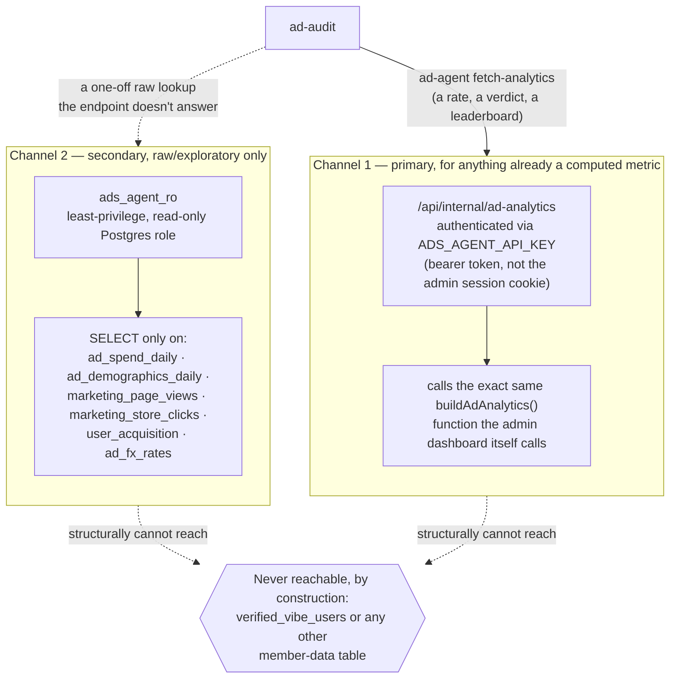

# Data access

Two separate channels reach into `pocket-dating-coach`'s real data, deliberately not one, with a firm
rule for which does what.

## Channel 1: the authenticated analytics endpoint (primary)

`ad-agent fetch-analytics --start <date> --end <date> [--network ...] [--audience ...]` calls
`pocket-dating-coach`'s `/api/internal/ad-analytics` endpoint, checked with a bearer token
(`ADS_AGENT_API_KEY`) instead of the admin session cookie. It returns the exact same JSON
`buildAdAnalytics()` produces for the real admin dashboard &mdash; the same `MIN_SAMPLE = 30` gate, the
same bot-traffic exclusion, the same ad-set-keyed leaderboard. This repo never re-derives that
aggregation itself; `pocket-dating-coach` stays the single owner of every rate, gate, and total.

**This is not live yet.** It's wired up and waiting on a small `pocket-dating-coach` pull request that
adds the route and the API key check &mdash; being built in a separate session, on the
`pocket-dating-coach` repo, not this one. Until it ships, `fetch-analytics` fails with a clear message
rather than a stack trace, and `ad-audit` says so plainly rather than falling back to a guess.

## Channel 2: a least-privilege read-only database role (secondary)

`ads_agent_ro` &mdash; not built yet either &mdash; is scoped to `SELECT` on six marketing/spend tables
only (`ad_spend_daily`, `ad_demographics_daily`, `marketing_page_views`, `marketing_store_clicks`,
`user_acquisition`, `ad_fx_rates`), configured via `config.local.yaml`'s `pdc.readonly_db_url`. It exists
purely for raw, exploratory lookups the analytics endpoint doesn't answer &mdash; a freshness check, a
one-off row inspection &mdash; **never to recompute a rate or verdict channel 1 already owns.** Two
independently-computed answers to "what's the tap rate on this ad set" would be a worse failure mode
than not having the number at all, so this rule holds even once the role exists.

## The boundary that holds regardless of which channel is used

This agent never gets read access to `verified_vibe_users` or any other table carrying member data
&mdash; names, emails, chat transcripts, trust scores. This isn't a policy someone has to remember to
respect; it's structurally true, because the granted database role is scoped to marketing/ad tables only
by construction, and the analytics endpoint returns aggregated ad metrics, never member records.

## Read next

- [Safety-and-guardrails](Safety-and-guardrails) &mdash; how this boundary relates to the other one (Ads
  Manager is never written to)
- [Command cheatsheet](Command-Cheatsheet) &mdash; the exact `fetch-analytics` invocation
- [How the four modes work](How-the-four-modes-work) &mdash; where `ad-audit` uses this data
