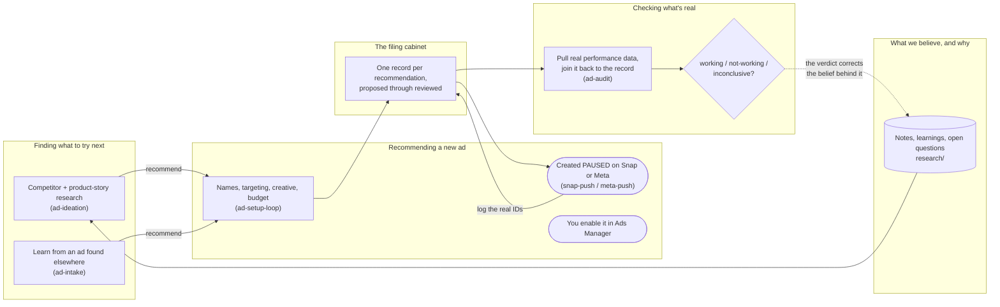

# ad-management-agent

**A private system that runs ad operations for Riteangle** (the product; the codebase and internal
identifiers say `verified_vibe_*`, and the consumer-facing site is `pocket-dating-coach`). It is not a
bot that touches Ads Manager — it recommends what to set up, researches what's actually working, digs
up what to try next, and learns from ads found elsewhere, so every campaign traces back to a reasoned
decision instead of ad hoc guesswork.

Everything here is written for someone who does **not** need to read code to understand it. If you're
picturing a small in-house ad-ops team (a planner, an auditor, a researcher, and a scout) working off
one shared filing cabinet, you already understand the shape of it.

## The big picture

The dotted edge at the bottom is the one that makes this a loop rather than a pile: a verdict does not
just close a record, it goes back and marks the belief that produced the recommendation as supported or
contradicted. See [The research loop](The-research-loop).

**Nothing in this loop can start spending money.** On Snap the system may create a campaign, ad squad
and ad for you, but only ever `PAUSED`, and it reads every object back to check it matches the plan.
On Meta it touches nothing at all and holds no credential. The step that starts the spend &mdash;
enabling an ad set, or raising the budget of one already live &mdash; is done by a person, every single
time, and is refused in code rather than merely discouraged. See
[Why it's built this way](Safety-and-guardrails).

## Read next

- **[How the four modes work](How-the-four-modes-work)** &mdash; the loop, step by step, in plain
  language
- **[The ledger](The-ledger)** &mdash; what "the ledger" actually is, and the lifecycle every
  recommendation moves through
- **[The rules](The-rules)** &mdash; the compliance, targeting, creative, naming, budget, and tracking
  files every mode reads live before it does anything
- **[Data access](Data-access)** &mdash; the two channels into Riteangle's real performance numbers, and
  the one boundary that never gets crossed
- **[Why it's built this way](Safety-and-guardrails)** &mdash; the safety reasoning behind the design
- **[Working across machines](Working-across-machines)** &mdash; how a laptop and cloud sandbox sessions
  stay in sync through GitHub alone
- **[Command cheatsheet](Command-Cheatsheet)** &mdash; every `ad-agent` command, grouped by what you're
  trying to do
- **[Technical architecture](Technical-Architecture)** &mdash; the actual stack and module map, for a
  technical reader
- **[Agent registry](Agent-Registry)** &mdash; every skill by name, its procedure, and exactly where it
  hands off to a human
- **[Glossary](Glossary)** &mdash; plain-language definitions of the terms used across these pages
