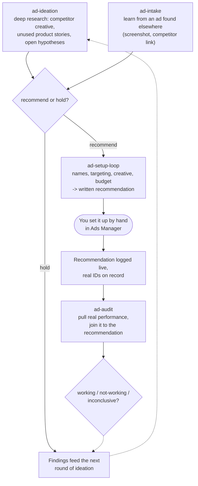

# How the modes work

There is no single "run everything" command. Each mode is a Claude Code **skill** you invoke by asking
for what you want in a session rooted in this repo &mdash; "set up an ad for the casual-selective women
persona," "how are the live ads doing," "find me some new ideas," "look at this ad I found," "here are
my notes on Truecaller." You should never need to remember a skill's name: describing the task is the
interface. The modes chain into one loop, but nothing advances automatically from one to the next; a person decides
when to move forward at every step.

## Mode 5 &mdash; `ad-setup-loop`: recommending a new ad

Given a brief (an approved idea, an intake finding, or a direct ask), this mode reads every rule file
under `rules/` live &mdash; never from memory &mdash; and works out campaign/ad-set/ad names (following
[the naming convention](The-rules#naming) exactly, since a name that doesn't match it breaks
`pocket-dating-coach`'s own spend/traffic join later), targeting, and a creative brief, plus a budget cap
and duration that are never left out. Before anything is handed off, the finished recommendation is
checked explicitly against `rules/compliance.md`, rule by rule &mdash; not just "this feels fine."

The output is a checklist a person can follow without re-deriving anything: exactly what to name each
level in Ads Manager and what to paste into targeting and budget fields. On Snap, `ad-agent snap-push`
can now execute that checklist for you &mdash; creating everything `PAUSED` and diffing it back against
the plan. On Meta the skill still never touches Ads Manager itself.

## The one non-negotiable step

Every recommendation stops at the same place, whichever mode produced the idea behind it: **a person
enables it.** Nothing in this system can enable anything, or change the budget of anything already
live, on either network &mdash; refused at the transport layer, not by convention. Creation is
permitted on Snap only, and only paused.

The loop is not closed until the real campaign/ad-set/ad IDs are on the record, either from
`snap-push`'s output or from `log-setup` after a hand-built setup. Without them `ad-audit` has nothing
to join a real outcome back to. See [Why it's built this way](Safety-and-guardrails) for the reasoning
and for what the 2026-08-26 amendment cost.

## Mode 6 &mdash; `ad-audit`: checking what's actually happening

Once a recommendation is live, this mode pulls real performance numbers (see [Data access](Data-access))
and joins each `live` record to its real outcome by `ad_set_id` &mdash; the same key
`pocket-dating-coach`'s own analytics uses internally, which is why `log-setup` records it that way.
Every verdict &mdash; `working`, `not-working`, or `inconclusive` &mdash; respects the same `MIN_SAMPLE =
30` floor the product's own admin dashboard uses. Below that sample, "not enough data yet" is the
correct, honest answer, not a guess dressed as a finding.

## Mode 7 &mdash; `ad-ideation`: researching what to try next

A deliberately looser mode &mdash; it's proposing hypotheses to test, not reporting on data that already
exists. It looks at competitor creative (Meta Ads Library, Snap's public ads library), product stories
that are built and live but never turned into an ad, and open hypotheses already flagged in
`rules/targeting.md`. Every idea still ends in a plain verdict &mdash; **`recommend`** or **`hold`**
&mdash; with an estimated spend, mirroring `ad-audit`'s own confidence discipline: an idea with no stated
cost is missing the thing a person would actually decide on. An approved idea feeds straight into
`ad-setup-loop`.

## Mode 8 &mdash; `ad-intake`: learning from an ad found elsewhere

The habit this mode serves: you see an ad somewhere &mdash; a competitor's Meta/Snap ad, a screenshot
&mdash; and bring it here to learn from. It reads what's actually there (extracting the hook, the visual
style, the claim, the call to action directly from a pasted image, not guessing at it), checks it against
`rules/creative-style.md`'s competitive-landscape notes, and says specifically what's working or not
&mdash; grounded in the actual creative, never generic ad-copy commentary. Anything a competitor does
that Riteangle's own compliance rules forbid becomes a lesson in what *not* to copy, never a template.
It can optionally turn into a formal idea and hand off to `ad-setup-loop`, the same way `ad-ideation`
does.

## Read next

- [The ledger](The-ledger) &mdash; where every recommendation actually gets written down
- [The rules](The-rules) &mdash; the files every mode reads before doing anything
- [Agent registry](Agent-Registry) &mdash; the same loop, traced through the actual skill files and CLI
  commands

## Mode 9 &mdash; `ad-research`

Added 2026-08-26, alongside the research store. It works an open question from the queue, ingests notes
brought in by hand, and derives durable learnings into `research/`. It is the mode that *fills* the
library the other four read from.

It exists because modes 7 and 8 had no write path at all: `ad-ideation` and `ad-intake` reasoned in a
session and produced prose that died with it &mdash; the only two modes in the system with no
persistence. Both now write too, but neither is the right home for "go and find out whether X is true,"
which is its own job with its own discipline.

The discipline that makes it worth having is the confidence gate: only `live-data`, `platform-doc` and
`source-code` claims may be recorded as `high` confidence, and a `live-data` claim below
`MIN_SAMPLE = 30` can only be `low`. A competitor observation or an informed hunch caps at `medium`
however convincing it feels. See [The research loop](The-research-loop).

A research pass starts with `ad-agent open` and ends with at least one `learn` or one `question`
written down. A pass that raises more questions than it closes is not a failed pass &mdash; but a pass
that writes nothing has not happened.
