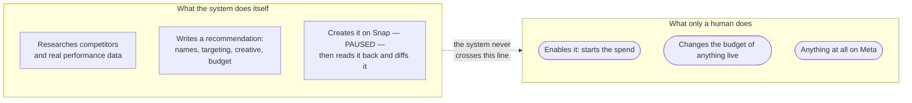

# Why it's built this way

A few decisions in this system look like they add friction on purpose. They do, deliberately, and this
page explains why each one earns its keep.

## Nothing this agent creates can spend money

> **Amended 2026-08-26.** This page previously said the agent never calls a Meta or Snap Ads Manager
> API at all, and holds no credential that could. **That is no longer true for Snap**, and the change
> was the app owner's explicit call after the trade-off was put to them. The section below describes
> what actually stands now. Meta is unchanged.

The boundary moved, but it did not blur. What stands:

- **Snap: creation yes, enabling never.** `ad-agent snap-push` creates campaigns, ad squads, creatives
  and ads &mdash; **always with status `PAUSED`** &mdash; and reads every object back from the API to
  diff it against the plan before it exits, because a 200 from a POST is not evidence that an ad squad
  targets who you think it targets. Starting spend is a human action in Ads Manager, every time.
- **Meta: unchanged, entirely hands-off.** No Ads Manager call, no Marketing API credential. Research
  (`ad-ideation`, `ad-intake`) works from public sources &mdash; the Meta Ads Library, Snap's public ad
  search, Google's Ads Transparency Center &mdash; and from `pocket-dating-coach`'s own exports.
- **Never change the budget of anything already live**, on either network.

Why the line sits exactly there: money and audience reach are what is on the table, and the moment that
matters is not creation but *enablement*. A paused object spends nothing, can be inspected in the UI,
and can be deleted. So the agent is allowed to do the tedious, error-prone part &mdash; forty fields
typed correctly, every UTM parameter literal rather than a macro that can silently fail &mdash; and is
not allowed to do the part where money starts moving.

This holds for the future Claude plugin the system's author has described, one that would "steer"
implementation directly inside Ads Manager. That plugin's job, if it is ever built, is telling the human
exactly what to click, field by field &mdash; never clicking the thing that starts spend.

## What was lost, and what replaced it

Be straightforward about the cost. The old rule was enforced by construction: the repo held no
credential that could reach a live account, so "never touches Ads Manager" was not a policy anyone had
to keep honoring &mdash; it was a fact about what was possible. `config.local.yaml` now holds a Snap
OAuth client id, secret and refresh token. That guarantee is gone, and no amount of careful wording
brings it back.

What replaced it is weaker, and worth stating precisely so nobody mistakes it for the original:

1. **A transport-layer refusal.** Every outbound request passes through one function,
   `SnapClient._call`, which inspects the payload at every nesting depth &mdash; Snap wraps each object
   in a list under a plural key, so a dangerous field is never at the top level &mdash; and refuses any
   enabling status value, or any budget field on a `PUT`. Creation carrying a budget is allowed;
   changing one on an object that already exists is not. There is no override flag.
2. **At the choke point, not at each call site.** This is the whole design: a method added six months
   from now cannot skip a check it never knew about.
3. **Tested as an invariant.** `tests/test_snap_safety.py` asserts every enabling spelling is refused,
   that the real create paths still pass, and that a refused request never reaches the network.
4. **Paused-only creation, plus a mandatory read-back diff**, as above.
5. **Access tokens minted per run** from the refresh token, never written to disk.

That is a guarantee held up by code and tests rather than by the absence of a key. It is the honest
description, and the reason this section exists rather than a line saying the rule is unchanged.

## The database and API access are both scoped as narrowly as the job allows

The same shape shows up in [Data access](Data-access): the read-only database role can only ever
`SELECT` from six marketing/spend tables, and the authenticated analytics endpoint returns aggregated
metrics, never raw member rows. Neither channel can reach `verified_vibe_users` or any other table
carrying member data &mdash; names, emails, chat transcripts, trust scores &mdash; by construction of
what's been granted, not by a rule someone has to remember to follow.

## No metered API key, anywhere, in this repo

Unlike `job-hunt-agent`, there's no Python module in here that calls the Anthropic API directly. Every
mode is a Claude Code skill that does its actual reasoning live, inside whatever session is running it,
under the person's existing subscription &mdash; the `ad-agent` CLI never imports or calls an Anthropic
client. It's a pure persistence layer: file reads and writes, plus one plain HTTP call to
`pocket-dating-coach`'s own endpoint. This keeps the cost model simple (nothing here is metered per
call) and keeps the ledger's writer identical regardless of which Claude Code session or model produced
the recommendation.

## Code and business-sensitive data live in the same private repo, on purpose

Unlike `job-hunt-agent` (whose code repo is separated from a personal spreadsheet that never leaves a
laptop), this repo's ledger &mdash; targeting, budget figures, creative strategy &mdash; **is** business
data, and it's checked into the same private repository as the code. That's a deliberate choice, not an
oversight: the whole point of `campaigns/*/record.md` is to be a shared, versioned audit trail that both
a person and every skill read the same way, and a private GitHub repo already provides that. `SPEC.md`
decision #9 states this plainly: the repo is private because targeting, budget, and creative strategy
are business-sensitive.

## An audience is never sent to a page written for someone else

The first live lead campaigns produced **98% male lead-form submissions and 100% male store taps**.
Part of that was creative, but the harder blocker was the destination: Riteangle's `/get` page is
written in the second person to a man on every line, so a woman tapping a women's ad landed on a page
about how a man gets in front of her.

`ad-agent propose` now refuses to write a record whose ad-set audience doesn't match the framing of its
landing page, per the registry in `rules/destinations.yaml`. Unregistered pages fail closed rather than
being assumed safe.

What makes this a real guardrail rather than a warning is that **there is no override flag**, and
`ad-agent amend` re-runs the same check rather than offering a way around it. A blocked proposal is
unblocked by building the page and registering it &mdash; which is the point, because the alternative is
spending real money sending an audience somewhere that cannot convert it. The trade-off was deliberate
and is worth naming: this can block a campaign on a web change that hasn't shipped yet.

## A recommendation is a proposal, not an action, until a human closes the loop

Every `ad-setup-loop` output starts life as `proposed` in [the ledger](The-ledger) &mdash; not `live`,
not assumed-executed. A person decides whether to actually build it in Ads Manager at all; if they don't,
the honest and required next step is `ad-agent abandon`, not letting it sit unresolved. This is the same
shape as `job-hunt-agent`'s "candidate, not instant approval" rule for a newly discovered company &mdash;
a person stays in the loop on the decision, not just on catching a mistake after the fact.

## Confidence gating is inherited, not invented here

`ad-audit`'s `working` / `not-working` / `inconclusive` verdicts respect the exact same `MIN_SAMPLE = 30`
floor `pocket-dating-coach`'s own admin dashboard uses. This system doesn't get to loosen that bar just
because it's a separate codebase &mdash; "not enough data yet" is treated as a real, reportable finding,
never smoothed over into a guess dressed as a conclusion.

## Read next

- [Data access](Data-access) &mdash; the two channels this page's database/API section summarizes, in
  full
- [The ledger](The-ledger) &mdash; the proposed → live → reviewed lifecycle this page's "closes the
  loop" section refers to
- [Working across machines](Working-across-machines) &mdash; how the private repo itself stays in sync
  across a laptop and cloud sessions
