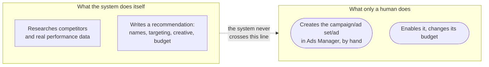

# Why it's built this way

A few decisions in this system look like they add friction on purpose. They do, deliberately, and this
page explains why each one earns its keep.

## Ads Manager is never touched directly

This is the single non-negotiable rule in `SPEC.md`, and it's stricter than the equivalent rule in
`job-hunt-agent` (which never automates sending a LinkedIn message, mainly to protect one person's
account from a platform ban). Here, money and audience reach are directly on the line &mdash; a wrong
automated action doesn't just risk an account, it spends real budget against a real audience with no
human in the loop at the moment it happens. So the boundary is drawn wider: this agent doesn't just
avoid *sending*, it never calls a Meta or Snap Ads Manager API **at all**, for anything &mdash; not to
create, not to publish, not to enable, not to change a budget. It doesn't even hold a credential that
*could* do any of those things (see "No credential that could reach a live account," below). Every
`ad-setup-loop` output is a checklist a person executes by hand.

This holds even for a future Claude plugin the system's author has described, one that would "steer"
implementation of a recommendation directly inside Ads Manager. That plugin's job, if it's ever built,
is telling the human exactly what to click, field by field &mdash; never clicking it.

## No credential that could reach a live account, at all

It would be possible to *say* "never call the Ads Manager API" as a policy and still hold a Meta/Snap
Marketing API credential that technically could. This system doesn't: it holds no Meta or Snap Marketing
API credential of any kind. Research (`ad-ideation`, `ad-intake`) works from public sources &mdash; the
Meta Ads Library, Snap's public ad search, Google's Ads Transparency Center &mdash; and from
`pocket-dating-coach`'s own exports, never a direct, credentialed connection to either ad platform. That
makes the "never touches Ads Manager" rule structurally true rather than merely a policy someone has to
keep honoring.

## The database and API access are both scoped as narrowly as the job allows

The same shape shows up in [Data access](Data-access): the read-only database role can only ever
`SELECT` from six marketing/spend tables, and the authenticated analytics endpoint returns aggregated
metrics, never raw member rows. Neither channel can reach `verified_vibe_users` or any other table
carrying member data &mdash; names, emails, chat transcripts, trust scores &mdash; by construction of
what's been granted, not by a rule someone has to remember to follow.

## No metered API key, anywhere, in this repo

Unlike `job-hunt-agent`, there's no Python module in here that calls the Anthropic API directly. Every
mode is a Claude Code skill that does its actual reasoning live, inside whatever session is running it,
under the person's existing subscription &mdash; the `ad-agent` CLI never imports or calls an Anthropic
client. It's a pure persistence layer: file reads and writes, plus one plain HTTP call to
`pocket-dating-coach`'s own endpoint. This keeps the cost model simple (nothing here is metered per
call) and keeps the ledger's writer identical regardless of which Claude Code session or model produced
the recommendation.

## Code and business-sensitive data live in the same private repo, on purpose

Unlike `job-hunt-agent` (whose code repo is separated from a personal spreadsheet that never leaves a
laptop), this repo's ledger &mdash; targeting, budget figures, creative strategy &mdash; **is** business
data, and it's checked into the same private repository as the code. That's a deliberate choice, not an
oversight: the whole point of `campaigns/*/record.md` is to be a shared, versioned audit trail that both
a person and every skill read the same way, and a private GitHub repo already provides that. `SPEC.md`
decision #9 states this plainly: the repo is private because targeting, budget, and creative strategy
are business-sensitive.

## An audience is never sent to a page written for someone else

The first live lead campaigns produced **98% male lead-form submissions and 100% male store taps**.
Part of that was creative, but the harder blocker was the destination: Riteangle's `/get` page is
written in the second person to a man on every line, so a woman tapping a women's ad landed on a page
about how a man gets in front of her.

`ad-agent propose` now refuses to write a record whose ad-set audience doesn't match the framing of its
landing page, per the registry in `rules/destinations.yaml`. Unregistered pages fail closed rather than
being assumed safe.

What makes this a real guardrail rather than a warning is that **there is no override flag**, and
`ad-agent amend` re-runs the same check rather than offering a way around it. A blocked proposal is
unblocked by building the page and registering it &mdash; which is the point, because the alternative is
spending real money sending an audience somewhere that cannot convert it. The trade-off was deliberate
and is worth naming: this can block a campaign on a web change that hasn't shipped yet.

## A recommendation is a proposal, not an action, until a human closes the loop

Every `ad-setup-loop` output starts life as `proposed` in [the ledger](The-ledger) &mdash; not `live`,
not assumed-executed. A person decides whether to actually build it in Ads Manager at all; if they don't,
the honest and required next step is `ad-agent abandon`, not letting it sit unresolved. This is the same
shape as `job-hunt-agent`'s "candidate, not instant approval" rule for a newly discovered company &mdash;
a person stays in the loop on the decision, not just on catching a mistake after the fact.

## Confidence gating is inherited, not invented here

`ad-audit`'s `working` / `not-working` / `inconclusive` verdicts respect the exact same `MIN_SAMPLE = 30`
floor `pocket-dating-coach`'s own admin dashboard uses. This system doesn't get to loosen that bar just
because it's a separate codebase &mdash; "not enough data yet" is treated as a real, reportable finding,
never smoothed over into a guess dressed as a conclusion.

## Read next

- [Data access](Data-access) &mdash; the two channels this page's database/API section summarizes, in
  full
- [The ledger](The-ledger) &mdash; the proposed → live → reviewed lifecycle this page's "closes the
  loop" section refers to
- [Working across machines](Working-across-machines) &mdash; how the private repo itself stays in sync
  across a laptop and cloud sessions
