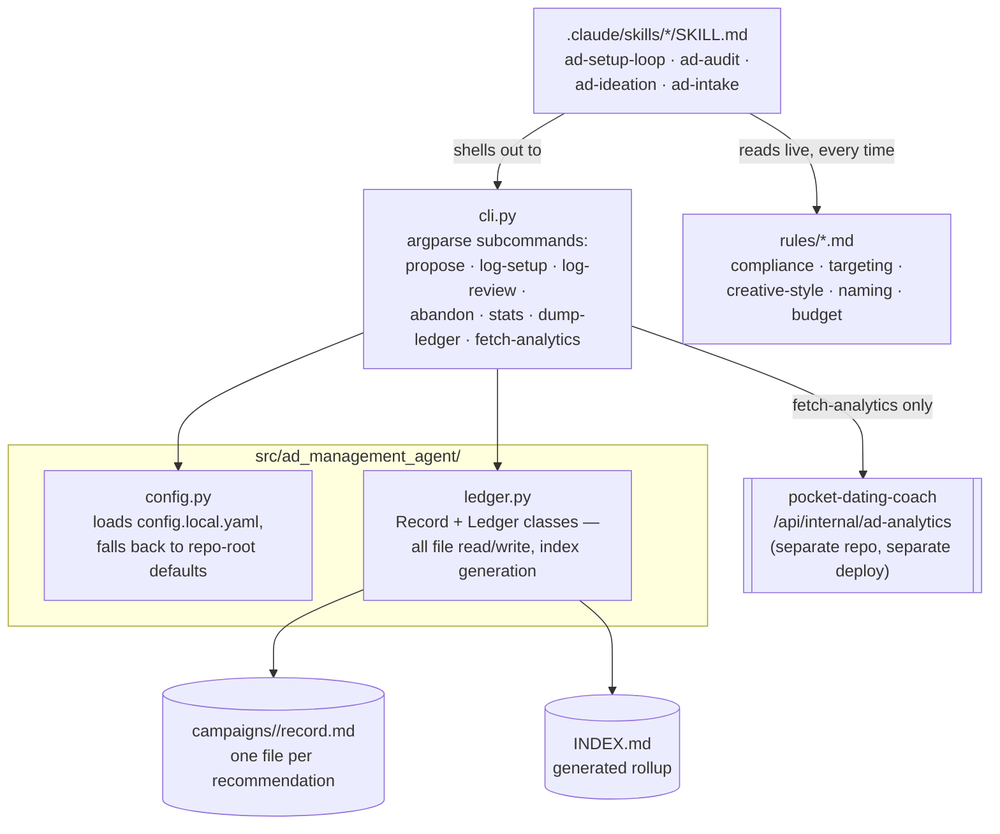
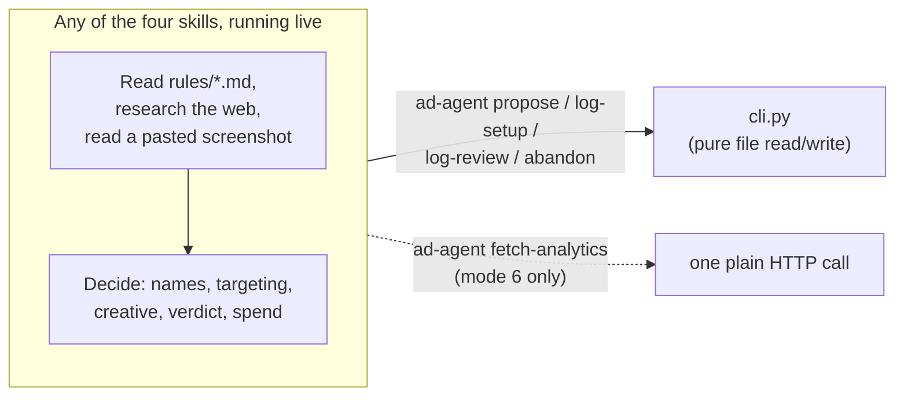

# Technical architecture

This page is for anyone who wants to know what the system is actually made of. For a plain-language
tour of how the loop behaves, see [Home](Home) and [How the four modes work](How-the-four-modes-work)
instead &mdash; this page assumes you're comfortable with terms like "CLI" and "front matter."

## Stack at a glance

| Layer | Choice | Why |
|---|---|---|
| Language | Python (`uv`/`hatchling`) | Matches `job-hunt-agent`'s toolchain exactly (`SPEC.md` decision #8) — same conventions, one less thing to context-switch on |
| LLM | None, in this repo | Every mode is a Claude Code skill; the CLI never imports or calls an Anthropic client (`SPEC.md` decision #1) |
| Ledger storage | Markdown files with YAML front matter, one per campaign, via **PyYAML** | Chosen over a spreadsheet (no pre-existing habit to extend, unlike job-hunt's Career Hacking Tracker) and over plain JSON (a human has to read this too) — see [The ledger](The-ledger) |
| CLI framework | Python's built-in **argparse**, one subparser per command | Small, dependency-free surface — `propose`, `log-setup`, `log-review`, `abandon`, `stats`, `dump-ledger`, `fetch-analytics` |
| External data | One plain HTTP call (`urllib`) to `pocket-dating-coach`'s internal endpoint | No SDK, no scraping, no credentialed connection to Meta or Snap at all (`SPEC.md` decision #10) |
| Packaging | `pyproject.toml`, installed with `pip install -e .` | Ships an `ad-agent` console-script entry point |
| Config | A gitignored `config.local.yaml`, loaded with PyYAML | Real endpoint URL, API key, and DB connection string live here, never in code |

## Module map

## Two very different shapes of "how a mode runs"

There is no Python module anywhere in this repo that calls the Anthropic API. Every one of the four
modes is a Claude Code **skill** &mdash; a `SKILL.md` instruction file under `.claude/skills/` &mdash;
that does its actual reasoning live, inside whichever Claude Code session is running it, using that
session's own web access and vision. The CLI this repo ships (`ad-agent ...`) is purely the persistence
layer that skill calls out to:

This is the inverse of `job-hunt-agent`'s architecture, which ships *both* a metered Python
reference implementation (`agents/*.py` calling the Anthropic API directly) and a zero-API skill twin
for each agent. `ad-management-agent` only ever ships the zero-API shape &mdash; `SPEC.md` decision #1
states plainly that there is no API-calling implementation planned for later; every mode's only harness
is a live Claude Code session.

## Why the ledger module is the only thing that touches the real files

`ledger.py` is the single choke point for all campaign-record I/O:

- `Ledger.find()` / `Ledger.all()` only read &mdash; nothing here mutates a record it read.
- `propose()`, `log_setup()`, `log_review()`, and `abandon()` each load a `Record`, update its front
  matter and append a body section, then call `Record.save()` &mdash; the front-matter block is always
  rewritten in full (via `yaml.safe_dump`) but the body only ever grows.
- `write_index()` regenerates `INDEX.md` from scratch, from the current state of every record, every
  time &mdash; which is exactly why hand-editing `INDEX.md` is pointless; the next command overwrites it.
- Slug collisions are handled by appending `-2`, `-3`, etc. to the folder name rather than overwriting
  an existing record.

No other module opens a `record.md` file directly.

## Why `fetch-analytics` is the CLI's only network call

Every other command is pure file I/O. `fetch-analytics` is the one exception, and deliberately narrow:
one GET request, with a bearer token, to one endpoint, returning JSON that's either printed to stdout
or written to a file with `--out`. There's no SDK dependency and no retry/backoff logic beyond a single
30-second timeout &mdash; if the URL or key isn't configured, or the request fails, the command exits
with a clear stderr message and a non-zero status rather than guessing at a result.

## What deliberately isn't here

- **No database.** The ledger is markdown files on disk; `pocket-dating-coach` owns the numeric data
  this system reads from, in its own Postgres database.
- **No server, no daemon, no cron in this repo.** Every mode is triggered by asking for it in a Claude
  Code session. `ad-audit` is the one candidate for a future scheduled task (`SPEC.md` decision #2), and
  only once it's been trusted from repeated manual runs — not attempted yet.
- **No Meta/Snap Marketing API client, and no credential for one anywhere in config or code** — see
  [Safety-and-guardrails](Safety-and-guardrails).
- **No dependency on `pocket-dating-coach`'s TypeScript.** The only coupling is an HTTP call to one JSON
  endpoint.

## Read next

- [The ledger](The-ledger) — the actual lifecycle and file format `ledger.py` implements
- [Data access](Data-access) — the full reasoning behind the two data channels
- [Agent registry](Agent-Registry) — every skill, traced against this module map
