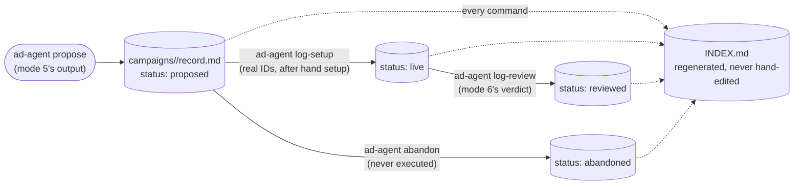

# The ledger

Every recommendation this system produces gets written down in one place: **`campaigns/<slug>/record.md`**,
one markdown file per campaign recommendation, with a YAML front-matter block on top and a new section
appended to the body every time the record moves forward. `INDEX.md` at the repo root is the
at-a-glance rollup &mdash; **it is generated, never hand-edited**; every ledger command regenerates it.



## Why markdown-plus-front-matter, and not a spreadsheet or plain JSON

`job-hunt-agent` (the sibling project this system borrows its shape from) already had a pre-existing
Excel workbook to build around &mdash; the *Career Hacking Tracker*. This project has no equivalent
habit to extend, and `pocket-dating-coach` already owns the numeric ledger (spend, taps, signups) in its
own database. What this ledger tracks instead is **decisions and creative briefs**, not metrics &mdash;
and a decision with reasoning attached reads far better as a markdown file with a human-readable body
than as a spreadsheet row or a JSON blob nobody wants to open by hand. `ad-agent dump-ledger` prints the
same rollup to the terminal for an ad hoc copy-paste, but the markdown files stay canonical.

## What's actually in a record

The front matter carries the structured fields: `rec_id`, `network`, `status`, the three names
(campaign/ad set/ad), `targeting_summary`, `creative_ref`, `destination_url`, `budget_cap_inr_per_day`, `duration_days`, and
&mdash; once set up &mdash; the real `campaign_id` / `ad_set_id` / `ad_id`, plus `verdict` once reviewed.
The body accumulates a section per stage: the original brief, an **Execution** section (with a
`--deviated` note if anything changed from the brief at setup time), and a **Review** section (the
verdict, a summary, and an optional longer review-detail file).

## The lifecycle, and why closing it out is mandatory

```
proposed → executing → live → reviewed
    ↑ ↓           ↓
  amend       abandoned
              ↓
          abandoned
```

- **`proposed`** &mdash; `ad-agent propose` was run; nothing has happened in Ads Manager yet. A
  proposal can still be corrected at this stage with `ad-agent amend`, which appends an `## Amendment`
  section recording what moved and why rather than quietly overwriting the record. Once it's `live`,
  it can't be &mdash; the record has to keep saying what was actually built.
- **`live`** &mdash; `ad-agent log-setup` recorded the real IDs after a person set the ad up by hand.
  The `ad_set_id` recorded here is deliberately the same join key `pocket-dating-coach`'s own analytics
  uses internally (`${network}:${adSetId}`), so `ad-audit` can look up real performance without anyone
  ever hand-attaching metrics.
- **`reviewed`** &mdash; `ad-agent log-review` wrote mode 6's verdict (`working` / `not-working` /
  `inconclusive`) back onto the record.
- **`abandoned`** &mdash; a proposal that was decided against before execution. Without this explicit
  close-out, an unexecuted proposal just sits as `proposed` forever and pollutes `stats`.

A `propose`d recommendation with no matching `log-setup` is an open loose end forever &mdash; `ad-audit`
has no real `ad_set_id` to join against, so it can never tell you whether the idea actually worked. This
is why closing the loop (either `log-setup` or `abandon`) is treated as mandatory, not optional, in every
skill that produces a proposal.

## Read next

- [How the four modes work](How-the-four-modes-work) &mdash; the loop that writes to and reads from this
  ledger
- [Command cheatsheet](Command-Cheatsheet) &mdash; the exact `ad-agent` invocation for every ledger
  transition
- [Technical architecture](Technical-Architecture) &mdash; `ledger.py`'s actual read/write guarantees
