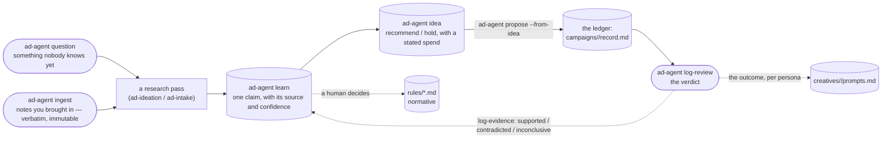

# The research loop

Two of the four modes &mdash; `ad-ideation` and `ad-intake` &mdash; used to reason in a session and
produce prose that died with it. They were the only modes in the system with no way to write anything
down. **`research/` and `ideas/` are that write path**, added 2026-08-26.

## The line between this and `rules/`

**`rules/` is normative.** A skill reads it and obeys. `rules/compliance.md` is not a well-supported
opinion about App Store guidelines; it is the thing that stops an ad shipping.

**`research/` is evidence and hypotheses.** Dated, sourced, revisable, sometimes contradicted by the
next thing that arrives.

Precedence is one-directional and absolute: **rules win.** Nothing under `research/` constrains
anything. A skill that finds a learning disagreeing with a rule follows the rule and raises a question.
The only way a claim becomes binding is a human promoting it into a rules file &mdash; an edit and a
decision, recorded afterwards with `ad-agent promote`, never a status change on its own.

### Why the separation exists

`rules/targeting.md` already carried inline parentheticals like *"the Aug 9 note records that
hard-hitting, feminist-coded copy tests well in this band."* The live women's record cites that note as
part of the justification for a &#8377;5,000 spend. There is no way to find out whether it came from a
measured result, a competitor screenshot, or a hunch &mdash; because a normative file had an
observation dropped into it with no source and no date. Every atom here carries where it came from, so
that cannot happen again.

## The four stores

| | what it holds |
|---|---|
| `research/notes/` | what someone actually brought in, **verbatim and immutable** |
| `research/learnings/` | one claim per file, with its source kind and confidence |
| `research/questions/` | the open-question queue |
| `ideas/` | proposal-shaped hypotheses, each with a verdict and a stated spend |

**Notes are immutable on purpose.** The content *is* the provenance &mdash; a claim pointing back at a
note that could have been rewritten proves nothing. A second `ingest` under the same id is refused, not
merged.

## Confidence is gated, not self-declared

`--confidence high` is refused unless the source is one of three kinds:

| source | may be `high`? | goes stale after |
|---|---|---|
| `live-data` | yes, with a sample size | 120 days |
| `platform-doc` | yes | 180 days |
| `source-code` | yes | 60 days |
| `own-research` | no &mdash; caps at `medium` | 120 days |
| `competitor-observation` | no | 60 days |
| `intuition` | no | 90 days |

A **`live-data`** claim must state `--sample-n`, and below `MIN_SAMPLE = 30` it can only be `low`. That
is [SPEC.md decision #6](Safety-and-guardrails), inherited from `pocket-dating-coach`'s own
`ad-analytics.ts`, applied here so a brief cannot lean on a number the dashboard itself would call
inconclusive.

**`source-code`** is for a fact read directly out of a codebase. It was added the day a statement about
what `audienceOf()` *does* &mdash; verifiable by opening the function &mdash; had to be filed alongside
hunches for want of a kind that fit. Reading code is as certain as reading a doc. What it is *not* is
durable: it describes something someone is actively changing, and one commit can invalidate it. High
confidence on a short clock is the right pairing for that, not a contradiction.

A claim past its `review_after` date is reported as **unverified**, which is not the same as wrong.

## The back-edge is the part that matters

Without it the library only ever grows and never corrects itself &mdash; and a store that confidently
records wrong things is worse than no store at all.

**You rarely run `log-evidence` by hand.** `ad-agent log-review` walks `record → idea → learnings` and
applies the verdict to every claim the recommendation rested on: `working` supports, `not-working`
contradicts, and **`inconclusive` records the evidence without moving the belief** &mdash; a campaign
can be unreadable for reasons that say nothing about the claim, a campaign cap below the funding floor
being the obvious one. The same command writes the outcome onto the creative's `prompts.md`, with the
audience and the *effective* daily spend, per `rules/creative-generation.md` §9.

Both used to be mandated in prose and enforced nowhere. A mandated manual step with no enforcement is a
step that stops happening around run four, so both are code paths. There is no flag to switch the
propagation off.

**One caution, since it is automatic:** an idea should cite only the learnings its test actually bears
on. Every one it lists receives the verdict, so a claim the campaign never varied will be marked on
evidence it did not produce. Nothing is lost &mdash; evidence is append-only and names the record
&mdash; but the fix is a narrower `--learning` list when the idea is written.

## Fixing a claim that was filed wrong

`ad-agent reclassify` corrects a learning's subject, source, confidence or sample size. It runs the same
confidence gate `learn` does, so it is not a way around the ceiling, and it recomputes the review clock
from `last_confirmed` rather than today, because re-filing is not reconfirming.

**The claim text cannot be changed there.** Evidence already attached was gathered against the claim as
written, and letting the wording move underneath it would make the whole trail lie. A claim that turned
out to be the wrong claim is `retire` plus a new atom.

## Reading it

`ad-agent open` surfaces everything outstanding: unanswered questions, notes nobody derived anything
from, learnings past review, learnings never tested, recommended ideas nobody proposed, and the worst
state in the system &mdash; a claim promoted into `rules/` that has since been contradicted, listed
with everything still citing it.

It also names the stores that are still empty, so a quiet report is never mistaken for a finished loop.

## Read next

- [Command cheatsheet](Command-Cheatsheet) &mdash; every verb, with the reasoning behind each
- [The ledger](The-ledger) &mdash; what happens after an idea becomes a proposal
- [The rules](The-rules) &mdash; the normative side of the line
