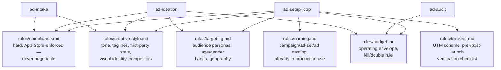

# The rules

Every skill reads six files under `rules/` live, every time &mdash; never from memory, and never
restated inside a skill file. If a rule gets refined mid-conversation, the skill edits the file in place
in the same turn; these are living documents, not a snapshot taken once and reused forever. This mirrors
`job-hunt-agent`'s own pattern (its `research.py` fit filter and `draft.py` style rules work the same
way): read the source, don't improvise, and keep the file current so the next session and the next
`ad-audit` run both see the same rules a person just refined.



## `rules/compliance.md` &mdash; the one file every finished draft is checked against

These come from the product's own marketing knowledge base, not from this repo's design process, and
they're enforced, not aspirational: the iOS build was actually **rejected by Apple under App Store
Guideline 1.1.4 ("compensated dating") on 2026-08-03**, and the codebase now has an automated
banned-vocabulary gate that fails the build if the removed wording reappears anywhere.

The rule worth understanding in full, because it's easy to flatten by accident: **money is never an
attraction signal in ad copy.** No lane may imply money, luxury, being kept, or a giver/receiver pair.
The matching *backend* is allowed to model "provider energy" as a real preference some women in the
casual segment genuinely have &mdash; that's a real signal worth matching on. **The ad copy itself may
never say it, imply it, or visually signal it.** Model it in the algorithm; never say it in the creative.
Everything else follows the same shape: no purchase language (there are no in-app purchases), referral
cash is never a rupee figure in copy, never call the membership "high-earning" (the approved phrasing is
"identity-verified and established professionals"), a man's real unenhanced photo never appears in an
ad, AI imagery is labelled, and everyone shown is 18+ without exception.

A finished draft that trips any of this is a decision for the app owner to make &mdash; never a copy
edit a skill quietly fixes and moves past.

## `rules/targeting.md` &mdash; who an ad set is actually for

Four named personas, picked one per ad set and named in the ad-set slug: **The Invisible Man**
(28&ndash;38, months of near-zero matches), **The Flooded Woman** (25&ndash;35, drowning in
low-quality matches), **The Second-Chapter Person** (post-divorce/late-30s+, wants seriousness without
family-mediated matchmaking), and **The Casual but Selective Woman** (18&ndash;28, the persona where the
provider-energy distinction above matters most). The core priority band is Women 18&ndash;30, Men
25&ndash;38, with two different creative treatments inside the women's band &mdash; wild-experience
energy for 18&ndash;22, security/safety/loyalty framing for 25&ndash;30. Geography prioritizes Bangalore,
then Delhi/Hyderabad, matching where the platform's own membership already concentrates. Ad sets are
always split by gender &mdash; never mixed.

## `rules/creative-style.md` &mdash; how it sounds and looks

Confident, precise, direct; never hype, jargon, or urgency. The primary tagline is **"Meet who you
actually want &mdash; in minutes, not months,"** with several site-native alternatives to rotate rather
than reuse across every ad in a set. Quotable numbers are first-party and measured &mdash; e.g. a median
12-minute time-to-first-match for men, or 54% of platform messages sent by an AI companion on someone's
behalf &mdash; quoted as rates and medians, never totals, since the platform is early and a total reads
as small in a way a rate doesn't. The visual identity is deliberately light (brand pink/coral on cream)
in a category where every rival ships a dark UI, using **Gabarito** throughout and the lowercase
wordmark **"riteangle."** This file also holds the competitive-landscape notes `ad-ideation` and
`ad-intake` both research against.

## `rules/naming.md` &mdash; the convention every recommendation must match exactly

Already in production use, confirmed against live rows in `pocket-dating-coach`'s own database (e.g.
`RA_TRAFFIC_GET_IN_BLR_TOF_202608`). Campaign names follow
`RA_TRAFFIC_GET_IN_[GEO]_[FUNNEL]_[YYYYMM]`; ad sets follow `[AUDIENCE]_[AGE]_[GENDER]_[SIGNAL]`; ads
follow `[FORMAT]_[HOOK]_[VARIANT]_[DATE]`. This isn't cosmetic &mdash; `pocket-dating-coach`'s own
analytics joins spend to traffic by parsing this exact structure out of the network's own naming and the
landing-page UTM parameters. A name that doesn't parse produces an ad set `ad-audit` can never reliably
attribute performance to later.

## `rules/budget.md` &mdash; the envelope every proposal is checked against

A roughly ₹50,000/month total operating budget, split 40&ndash;50% testing, 40&ndash;50% exploiting
proven winners, and 10% retargeting once there's signal to retarget against. A minimum viable daily
spend of ₹800&ndash;1,200 per active ad set &mdash; below that, the platform's own delivery algorithm
rarely exits its learning phase. The **kill/double rule**: pause a losing ad set after 3&ndash;5 days or
50&ndash;100 events, whichever comes first, and move its budget to whatever's winning. This file also
carries the `MIN_SAMPLE = 30` confidence floor `ad-audit` inherits from `pocket-dating-coach` itself.

## `rules/tracking.md` &mdash; the UTM scheme, and why it's now a hard gate

Added 2026-08-21, after an incident where **zero of 54** Snap-attributed installs over a full week
carried an ad-level id &mdash; every one of them landed in `pocket-dating-coach`'s admin dashboard with
a blank "Ad" column, permanently unattributable, because the ad's own destination URL never had
`utm_id` appended and the code comment's assumption that "Snapchat appends it automatically" turned out
not to hold. A separate, compounding bug: this repo's own naming convention had previously told people
to put the Snap ad id in `utm_content`, but `pocket-dating-coach`'s join code only ever reads `utm_id`
for Snap &mdash; so even a correctly-filled-in `utm_content` would never have shown up as an ad name.

The corrected URL every ad must carry:

```
https://www.riteangle.dating/get?utm_source={snapchat|meta}&utm_medium=paid_social&utm_campaign={{campaign.name}}&utm_term={{adSet.id}}&utm_id={{ad.id}}&utm_content={{ad.name}}
```

`utm_id={{ad.id}}` is now set explicitly on every ad's own Website URL field &mdash; never assumed. Two
checks are non-negotiable parts of `ad-setup-loop`'s procedure, not optional follow-up:

- **Pre-launch** (before any spend): open the ad's actual Website URL field and confirm every macro is
  present and set at the ad level, then click the ad's own preview/swipe-up link and confirm every
  macro resolved to a real value &mdash; not blank, not a literal `{{adSet.id}}`/`{{ad.id}}` string.
- **Post-launch** (within the first hour of real traffic): query `pocket-dating-coach`'s
  `user_acquisition` table for the network just launched and confirm real rows are landing with
  `utm_term`/`utm_id` populated, not the landing page's hardcoded default. `log-setup` isn't considered
  closed until this has run once against live data.

## Read next

- [How the four modes work](How-the-four-modes-work) &mdash; where each of these files gets read in the
  loop
- [Safety-and-guardrails](Safety-and-guardrails) &mdash; the boundary rules that sit outside `rules/`,
  in `SPEC.md` itself
- [Agent registry](Agent-Registry) &mdash; which skill reads which file, traced through the actual
  procedure steps
