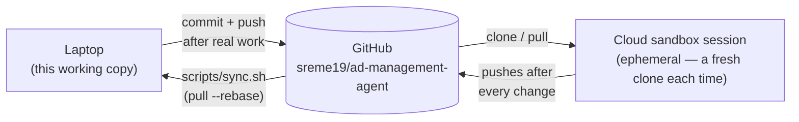

# Working across machines

This repo lives in three places at once: a laptop, cloud Claude Code sandbox sessions spun up later
(ephemeral &mdash; reclaimed after inactivity), and GitHub. A sandbox never sees the laptop directly, and
the laptop never sees a sandbox directly &mdash; **GitHub is the only channel between them.**

## Why this matters

A sandbox only ever gets the current state by cloning or pulling &mdash; and only if the laptop's work
was actually committed and pushed first. Anything uncommitted, or committed-but-unpushed, is invisible
to every sandbox no matter how recently it was written. The whole point of running this system from two
different kinds of environment on the same repo depends on GitHub always reflecting the latest real
state; there's no other sync path.

## The habits that keep it true

- **Commit and push right after any real unit of work** &mdash; a rule file edited, a creative asset
  dropped in, a ledger command that changed a campaign record or `INDEX.md`, any change to `src/`.
  Don't wait for a scheduled sync.
- **Run `scripts/sync.sh` (or at minimum add/commit/push) as the last action before ending a session on
  the laptop**, so GitHub is guaranteed current the moment work stops.
- **A cron job runs `scripts/sync.sh` every 30 minutes** as a safety net &mdash; a backstop, not the
  primary mechanism. Schedule it yourself with `crontab -e` (see the README for the exact line).

`scripts/sync.sh` is deliberately conservative: it commits any dirty state with a timestamped message,
fetches, `pull --rebase`s, then pushes. It never force-pushes and never discards work &mdash; if it
can't fast-forward cleanly, it stops and leaves the working tree alone rather than guessing.

## Merge conflicts

If the laptop and a sandbox both changed something without syncing in between, **never auto-resolve by
picking one side.** Surface the conflict plainly and ask the person which change should win. This
matters especially for anything under `campaigns/` &mdash; that ledger exists to be an honest audit
trail, and silently overwriting one side of a conflict defeats the entire purpose of keeping it.

## What never travels through GitHub, on purpose

`config.local.yaml` &mdash; the real `pocket-dating-coach` analytics API key and database connection
string &mdash; is gitignored by design. It will never appear on GitHub or reach any sandbox through this
sync path, and that's intentional, not a gap to fix. If a sandbox genuinely needs those real values,
they have to be provided to it separately and deliberately, never via git.

## Read next

- [Safety-and-guardrails](Safety-and-guardrails) &mdash; why the ledger itself lives in this same private
  repo despite being business-sensitive
- [The ledger](The-ledger) &mdash; the files this sync discipline exists to protect
